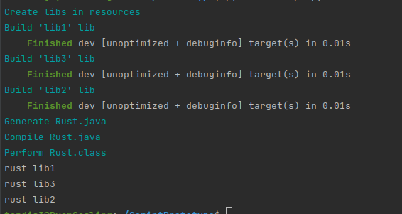
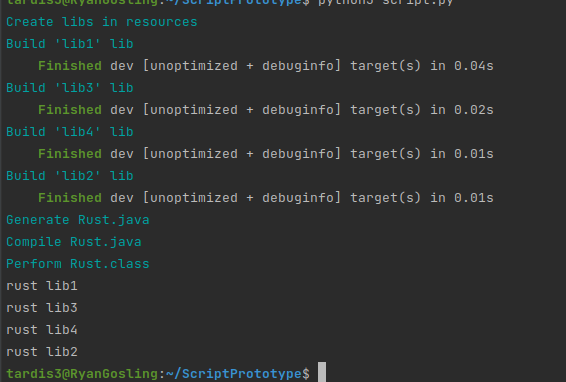

# The prototype with inline rust
## Problem statement
### For example, user has several shared libraries on rust. At launch user doesn't know the number of libs. 
### The task is to generate the `Rust.java` class with all native methods and call every of them in runtime.

### Running
Run script.py to run the program from the project directory:
```
$ python3 script.py
```
The output of the program will be something like this:



Briefly the script compile rust libs from `src/resources/libs`, generates `Rust.java` according to libs in resources, compile it and start `Rust.class` from `build`. 
Name of the libs start with "lib" and consist of letters and numbers.

### Adding a lib
You can add a new lib in resources running like
```
$ python3 ./tools/add_lib.py lib4
```
As soon as you have added a new library, in the generated file "Rust.java" there will be a new method to run it.
```
//Rust.java
...
    static void fun_lib2(){
        final Path lib = libs.resolve("lib2/target/debug/liblib2.so");
        System.load(lib.toString());
        System.out.println(lib2());
    }
    private static native String lib2();
...
```
So starting `script.py` again you get


Now it also call new lib!